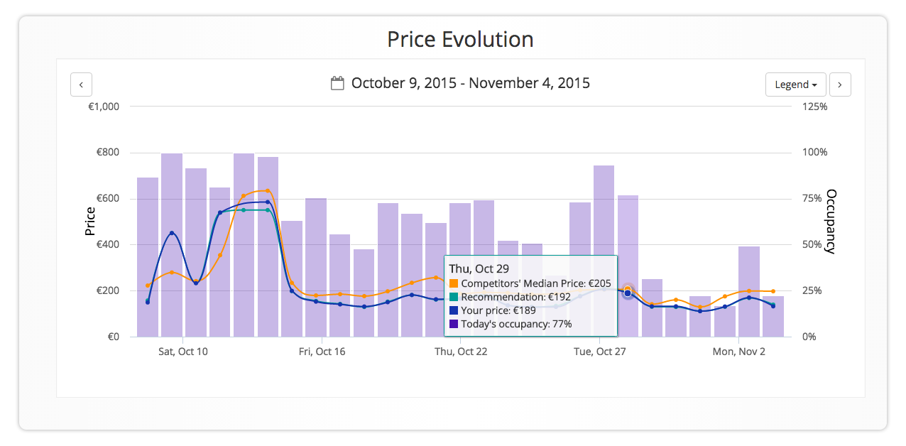

```{r setup, include=FALSE}
knitr::opts_chunk$set(echo = TRUE)
```

##Introduction

The only two recommender systems I regularly use are the ones employed by Netflix and Amazon. Netflix occassionally lists something that catches my attention, while Amazon almost never generates a click from me. However, doing my search for this assignment, I have come to realize that recommender systems may not be obvious to consumers. Consider travel planning sites. They have great control over search results when we are planning a trip. I believe the algorithm that decides who gets included on the first page has to have some similarity to recommender systems. The write-up below analyzes [Booking.com](https://www.booking.com).

<CENTER>

</CENTER>

##Scenario Analysis

**Target Users:** Booking.com is targeting individuals looking to book an accommodation. Since the company earns a commission on each booking, it is directly interested in increasing number of or average cost of bookings. Both factors have to work together, so ideally a customer will book a room at the highest price possible without going to another site. There may be another target that Booking.com is interested in: hotels that are listings their rooms on the site. Maintaining a healthy, large inventory is critical to user satisfaction, so the company needs to make sure that owners are happy with their collaboration. 

**Key Goals:** Users' key goal is to find a "good deal." For each user the definition of a good deal may be different and it includes many factors price, reviews, location, availability, etc. 

**Accomplishing Goals:** The recommender system will return results that satisfy user's criteria and at the same time brings the most profit to the company and hotel owners. Many factors can be considered - anything from past bookings to time of day - to build an algorithm that will try to predict the best match for the user. 

##Reverse Engineering the Algorithm

Opening Booking.com homepage it is immediately clear that past searches weigh heavily on the suggestions. I am currently planning a trip to Split, Croatia, which is the first destination suggested. Next are a couple of geographically close and similar cities -  Zadar and Zagreb (Old Town exploring is a major keyword for all three cities). Next the circle is expanded to include other suggestions for my "next escape." This section includes destinations I have not searched for - Nassau (Bahamas), Paris, Manzanillo (Mexico), so it may rely on similar customers. 

I have found a number of sites describing Booking.com algorithm as well as a number of Data Science student projects talking about it. One curious article is [*How to crack the Booking.com algorithm*](https://www.tnooz.com/article/crack-the-booking-com-algorithm/). It tries to guess how the algorithm is working from the perspective of hotel owners. Clearly, getting closer to the top of the search results is extremely beneficial for owners. A few points discussed:

- Increasing Booking.com commission
- Increasing number of positive comments
- Adding good photos
- Provide more information about the hotel



Booking.com is interested in making sure that customers book their rooms on the site, so it penalizes hotels that are not likely to generate a booking.

Booking.com, being one of the leaders of their industry, collects tremendous amount of valuable information about travel planning behavior. They have started offering a product, [BookingSuite](http://suite.booking.com/), to help hotel owners capitalize on that data. It recommends rates and provides rate analysis. 

##Recommended Improvements

I am generally happy with the site's performance. It has enough information about my past bookings to try and predict my preferances. Maintaining competitive and realiable inventory is critical. One area of improvement I can suggest is bringing in additional data not directly connected to lodging planning. For example, they can partner with TripAdvisor to suggest destinations and sites. I rarely pick destinations based on hotels, but if I am advertised a particularly interesting destination, I am more likely to start planning. 

##Summary

In reviewing information about Booking.com, I have realized that sites that offer products and services gather significant amount of very valuable data. Having the right algorithm that successfully and efficiently predicts what product the user will buy or what link the user will click can give a business a winning edge. The task, however, is not trivial. There are a lot of variables, the need for efficiency with large data sets, erratic human behavior. For now this is not an easy goal to reach.