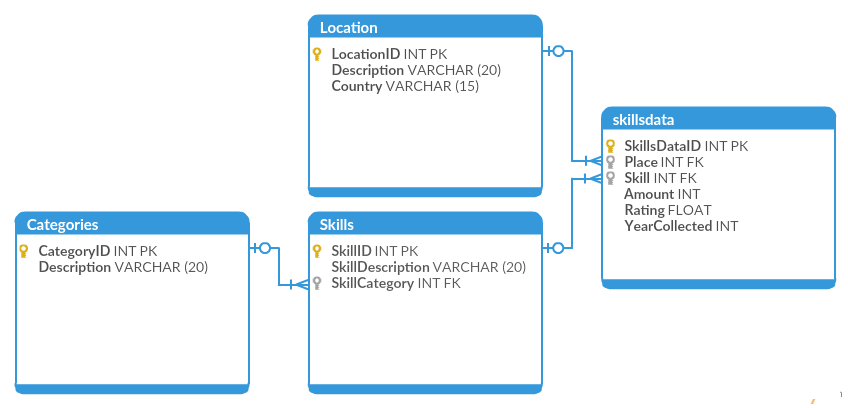
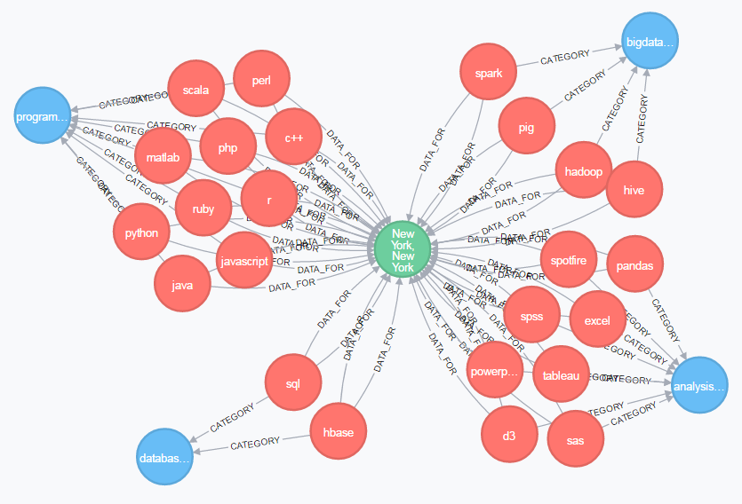

```{r setup, include=FALSE}
knitr::opts_chunk$set(echo = TRUE)
```

<STYLE>
body {
    font-size: 18px;
}
table {
    border: 1px solid black;
    font-size: 14px;
}
th {
    background-color: rgb(112, 196, 105);
    color: white;
    font-weight: bold;
    padding: 20px 30px;
}
tr:nth-child(even) {
    background-color: rgb(220,220,220);
}
tr:nth-child(odd) {
    background-color: rgb(255, 255, 255);
}
</STYLE>

## Assignment Objective

The object of this assignment is to develop understanding of data storage and retrieval mechanism for a NoSQL database. For this conversion, I have chosen the SQL database used for our Project 3 (Most Valuable Data Science Skills). Database structure is illustrated below. For the NoSQL database, I have chosen Neo4J. 

<CENTER>

</CENTER>

### Required Libraries

```{r requirements, results='hide', message=FALSE, warning=FALSE}
# SQL Database Access
library(RMySQL)

#Neo4J Database Access
library(RNeo4j)
```

## Retrieve SQL Data

### Establish Connection

```{r}
# Connect to a Google Cloud SQL database used for project 3
con <- dbConnect(MySQL(), 
                 user='root', 
                 password='data607pw', 
                 host='35.185.104.222', 
                 dbname='datascienceskills')
```

### Retrieve Data

```{r}
# Store all tables within data frames
location <- dbReadTable(con, "Location")
category <- dbReadTable(con, "Categories")
skill_data <- dbReadTable(con, "skillsdata")
skill_name <- dbReadTable(con, "Skills")
```

### Close Connection

```{r results='hide'}
dbDisconnect(con)
```

## Store Data in Neo4J

### Establish Database Connection

Connect to the default, local Neo4J database. 

```{r}
# Connect to the database
graph <- startGraph("http://localhost:7474/db/data/", 
                    username="neo4j", 
                    password="data607pw")

# Clear any existing data
clear(graph, input = FALSE)
```

### Store Available Data: Skill Categories

Each skill is assigned to one of four categories - *Programming Languages*, *Analysis Software*, *Big Data Tools* and *Databases*. Store category names as nodes.

```{r}
# Add constraint for ID migrated from SQL database
addConstraint(graph, "SkillCategory", "id")

# Neo4J query
query <- "CREATE (s:SkillCategory { id: {category_id}, name: {category_name}})"

# Start new transaction
trans <- newTransaction(graph)

# Loop through the data frame and add corresponding query to transaction
for (i in 1:nrow(category)) {
  appendCypher(trans, 
               query, 
               category_id = category[i, ]$CategoryID,
               category_name = category[i, ]$Description) 
}

# Commit all changes
commit(trans)
```

### Store Available Data: Location

Skills data was collected for multiple locations. Store each location as a node. Node name is City/State combination, but country is also preserved as node property.

```{r}
# Add constraint for ID migrated from SQL database
addConstraint(graph, "Location", "id")

# Neo4J query
query <- "CREATE (l:Location { id: {loc_id}, description: {loc_desc}, country: {loc_country}})"

# Start new transaction
trans <- newTransaction(graph)

# Loop through the data frame and add corresponding query to transaction
for (i in 1:nrow(location)) {
  appendCypher(trans, 
               query, 
               loc_id = location[i, ]$LocationID,
               loc_desc = location[i, ]$Description,
               loc_country = location[i, ]$Country) 
}

# Commit all changes
commit(trans)
```

### Store Available Data: Skills

Add skills as nodes and connect them to corresponding categories.

```{r}
# Add constraint for ID migrated from SQL database
addConstraint(graph, "Skill", "id")

# Neo4J query
query <- "MATCH (c:SkillCategory { id: {cat_id}})
          MERGE (s:Skill { id: {skill_id}, name: {skill_name}})
          CREATE (s)-[:CATEGORY]->(c)"

# Start new transaction
trans <- newTransaction(graph)

# Loop through the data frame and add corresponding query to transaction
for (i in 1:nrow(skill_name)) {
  appendCypher(trans, 
               query, 
               cat_id = skill_name[i, ]$SkillCategory,
               skill_id = skill_name[i, ]$SkillID,
               skill_name = skill_name[i, ]$SkillDescription) 
}

# Commit all changes
commit(trans)
```

### Store Available Data: Skills Data

Skills data is added as relationship between skills and corresponding locations. Collected data is available for 2016 and 2017 and each year is added as a separate relationship.

```{r}
# Neo4J query
query <- "MATCH (s:Skill { id: {skill_id}})
          MATCH (l:Location { id: {loc_id}})
          CREATE (s)-[:DATA_FOR { name: {data_year}, amount: {data_amount} }]->(l)"

# Start new transaction
trans <- newTransaction(graph)

# Loop through the data frame and add corresponding query to transaction
for (i in 1:nrow(skill_data)) {
  appendCypher(trans, 
               query, 
               skill_id = skill_data[i, ]$Skill,
               loc_id = skill_data[i, ]$Place,
               data_year = skill_data[i, ]$YearCollected,
               data_amount = skill_data[i, ]$Amount) 
}

# Commit all changes
commit(trans)
```

## Retrieve Results

Full graph is too busy to show the nodes and relationships. Below example pulls any skills mentioned in over 20 job listings for New York. 

```{r}
results <- cypher(graph, "MATCH (l:Location {id: 8})<-[d:DATA_FOR]-(s:Skill) MATCH (c:SkillCategory)<--(s) 
                          WHERE d.amount > 20 
                          RETURN s.name, d.amount, c.name")
colnames(results) <- c("Skill", "Count", "Category")
```

```{r echo=FALSE}
knitr::kable(results)
```

<CENTER>

</CENTER>

## Conclusion

Overall the conversion process was smooth. With some additional experience, especially in Neo4J query language, it should become a fairly routine exercise. The more difficult part is to identify proper database storage method (SQL vs. NoSQL) and proper database structure. I feel that for this particular data set, the tabular structure of a SQL database is a better and easier solution. 

Additionally, I have noticed that graph database structure is a lot more flexible and not necessarily intuitive (perhaps, this is just due to my lack of experience). I have set up skills, categories and locations as nodes with collected data as relationships. Perhaps, I could have broken down some data further. My first thought is to separate year the data was collected for into its own node. Then the number of listings a skill was mentioned in for a given year would describe the strength of the relationship between skill and year. 
