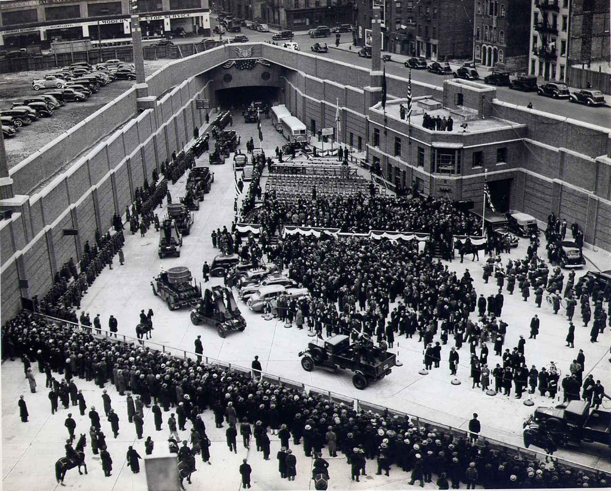

```{r setup, include=FALSE}
knitr::opts_chunk$set(echo = TRUE)
```

<STYLE>
body {
    font-size: 18px;
    font-family: "Times New Roman";
}
table {
    border: 1px solid black;
    font-size: 14px;
}
th {
    background-color: rgb(112, 196, 105);
    color: white;
    font-weight: bold;
    padding: 20px 30px;
}
tr:nth-child(even) {
    background-color: rgb(220,220,220);
}
tr:nth-child(odd) {
    background-color: rgb(255, 255, 255);
}
</STYLE>

## Assignment Objective and Summary

The objective of this assignment is to retrieve information using one of The New York Times APIs and store it in a data frame. I have chosen to work with the Article Search API.  Considering that NYT's archive goes back to September 1851, I was curious to access information about my new hometown of Weehawken, NJ (incorporated 1859).

### Required Libraries

```{r requirements, results='hide', message=FALSE, warning=FALSE}
library(RCurl)
library(tidyjson)
library(dplyr)
library(tidyr)
library(ggplot2)
```

## Data Retrieval and Analysis

### Quick Test

Retrieve search results with no parameters (with the exception of search query term).

```{r}
# Set up URL to access NYT API
api_key <- "&api-key=615feb0a12634c4789194e29202022ee"
search_criteria <- "weehawken"
main_url <- "http://api.nytimes.com/svc/search/v2/articlesearch.json?q="

# Retrieve data from NYT
request <- getURL(paste0(main_url, search_criteria, api_key))

# Parse article data
articles <- request %>% 
  enter_object("response") %>%
  enter_object("docs") %>% 
  gather_array("document.id") %>%
  spread_values(pubdate = jstring("pub_date"), 
                snippet = jstring("snippet"),
                url = jstring("web_url"))

# Parse headline data
headlines <- request %>% 
  enter_object("response") %>%
  enter_object("docs") %>% 
  gather_array("document.id") %>%
  enter_object("headline") %>% 
  spread_values(mainheadline = jstring("main"))

# Format for display
articles <- articles %>% 
  left_join(headlines, by = "document.id") %>%
  transform(Publication.Date = format(as.Date(pubdate), format="%B %d, %Y")) %>% 
  select(Publication.Date,
         Main.Headline = mainheadline, 
         Snippet = snippet,
         URL = url)
```

```{r echo=FALSE}
knitr::kable(articles)
```

I have started with `jsonlite` package, but once I realized that `headline`, `keywords`, and others are nested objects, it was easier to switch to `tidyjson`. It seems easier to gather necessary data directly from the JSON structure than manipulating the nested data frames generated by `fromJSON`.

### Additional Analysis

Retrieve 10 pages (100 hits) and analyze timeline of publication dates and most commonly used keywords.

```{r}
# Set fields to return
fields <- "&fl=pub_date,keywords"

# Set up empty data frames to gather results from individual pages
dates <- data.frame(document.id=integer(), pubdate=character())
keywords <- data.frame(document.id=integer(), keyword=character())

# Loop through 10 pages
for(i in 0:9) {
  # Set page number
  page <- paste0("?page=",i)
  
  # Retrieve data from NYT
  request <- getURL(paste0(main_url, search_criteria, page, fields, api_key))

  # Parse dates data
  dates_i <- request %>% 
    enter_object("response") %>%
    enter_object("docs") %>% 
    gather_array("document.id") %>%
    spread_values(pubdate = jstring("pub_date")) %>% 
    mutate(document.id = document.id + i*10,
         pubdate = as.Date(pubdate))
  dates <- rbind(dates, dates_i)

  # Parse keyword data
  keywords_i <- request %>% 
    enter_object("response") %>%
    enter_object("docs") %>% 
    gather_array("document.id") %>%
    enter_object("keywords") %>% 
    gather_array() %>% 
    spread_values(keyword = jstring("value")) %>% 
    transform(document.id = document.id + i*10) %>% 
    select(document.id, keyword)
  keywords <- rbind(keywords, keywords_i)
  
  # It seems that quick consecutive requests are not handled properly
  # Insert pause between each request
  # Since only looking at 10 pages, a 2 second delay is not too costly
  Sys.sleep(2)
}
```

Find and plot 20 most common keywords. 

```{r message=FALSE, warning=FALSE}
# Get a list of top 20 keywords
top_keywords <- keywords %>% 
  group_by(keyword) %>% 
  summarise(count = n()) %>% 
  arrange(desc(count)) %>% 
  top_n(20)

# Plot top keywords
ggplot(data = top_keywords, aes(x = keyword, y = count)) + 
  geom_bar(stat="identity") +
  coord_flip() +
  labs(x = "", y = "")
```

The list includes references to railroads, ferries and tunnels - not surprising for Weehawken as it is home to one of two tunnels, Lincoln Tunnel, connecting NJ and New York City. It was also terminal destination for railroads. From here goods could be loaded onto barges for delivery to New York City or, in the opposite direction, unloaded from barges for exporting to the rest of the country). The list also includes several non-descriptive keywords such as _United States_, _NJ_, _New York City_ and _Weehawken_.

Plot number of articles by publication month. 

```{r}
# Prepare dates for plotting
dates2 <- dates %>% 
  transform(month = substr(pubdate, 1, 7)) %>% 
  group_by(month) %>% 
  summarise(count = n()) %>% 
  select(month, count)

# Plot monthly article counts
ggplot(data = dates2, aes(x = month, y = count, group = 1)) + 
  geom_col() +
  coord_flip() + 
  labs(x = "", y = "")
```

Please note that the months are not spaced proportional to the timeline.

Something clearly happened in December 1937. Looking into it, I discovered for myself that the Lincoln Tunnel, connecting Weehawken and New York City, was opened on December 21, 1937. Below is the opening ceremony on the New York City side. 

<CENTER>

</CENTER>

Weehawken is not associated in my mind with coal, so I decided to take a look at why it comes up so often in keywords. Breakdown top keywords by publication month accounting for number of articles for each.

```{r}
# Isolate publication month and join it with top 20 keywords
keywords_by_date <- dates %>% 
  transform(month = substr(pubdate, 1, 7)) %>% 
  select(document.id, month) %>% 
  inner_join(keywords, by = "document.id") %>% 
  group_by(keyword, month) %>% 
  summarise(count = n()) %>% 
  inner_join(top_keywords, by = "keyword") %>% 
  select(keyword, month, count = count.x)

# Plot keywords by publication month and factor in number of articles
ggplot(data = keywords_by_date, aes(x = month, y = keyword)) + 
  geom_point(aes(size = count)) +
  labs(x = "", y = "") +
  theme(axis.text.x=element_text(angle=90, hjust=1))
```

It looks like all articles mentioning coal were published in November 1946. Looking into it further it turned out that coal was mentioned in only several articles (nothing particularly interesting) and it was also listed several times per article racking up keyword count.

## Conclusion

I have practiced retrieving information using API, including specifying query parameters, as well as manipulating data retrieved in JSON format. I have also learned that Lincoln Tunnel is celebrating 80 years in 2017.